# Sistema de Controle de Ponto e Acesso

## Descrição do Projeto

Este projeto tem como objetivo criar uma API REST para o controle de ponto e acesso de funcionários em uma empresa. A aplicação permite registrar a jornada de trabalho, controlar o nível de acesso de usuários e monitorar movimentações de entrada e saída. Utilizando o Spring Boot, a aplicação é facilmente escalável, robusta e bem documentada, com integração de Swagger para visualização e teste dos endpoints.

### Funcionalidades principais

- **Registro de Jornada de Trabalho:** Permite o cadastro, consulta, atualização e remoção de jornadas de trabalho.
- **Controle de Nível de Acesso:** Cada usuário pode ter diferentes níveis de acesso para áreas restritas da empresa.
- **Registro de Movimentação:** O sistema permite o controle de entrada e saída dos funcionários, registrando suas movimentações de forma segura.
- **Banco de Dados H2:** Utilizado para armazenamento temporário durante o desenvolvimento.
- **Auditoria com Hibernate Envers:** Todas as modificações feitas nas entidades são auditadas automaticamente.

## Tecnologias Usadas

- **Java 17**
- **Spring Boot 3.0.0**
- **Spring Data JPA (Hibernate)**
- **Hibernate Envers** (Auditoria de dados)
- **Swagger** (Documentação da API)
- **Banco de dados H2** (Modo de testes)
- **JUnit e Mockito** (Testes unitários)
- **Gradle** (Gerenciamento de dependências)
- **Git** (Controle de versão)
  
## Estrutura de Pastas e Arquivos

Abaixo está a estrutura principal do projeto:

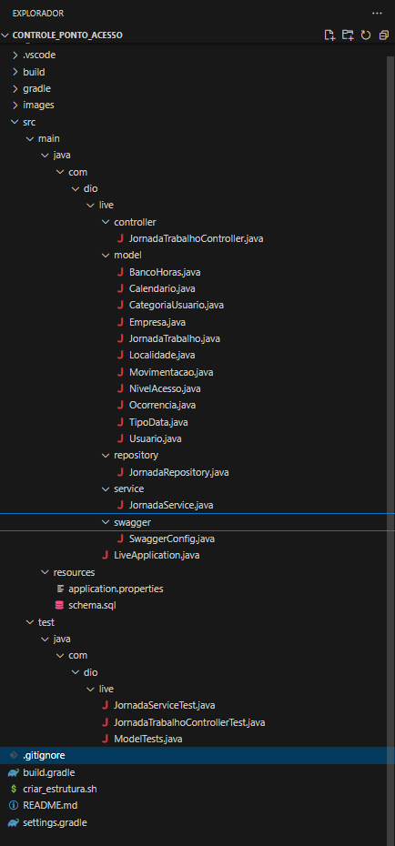

## Comandos Utilizados

### Limpeza do projeto

gradle clean

### Compilação e execução do projeto

gradle bootRun

### Execução dos testes

gradle test

### Gerenciamento de dependências

gradle build

### Testes unitários e de integração

Os testes unitários são implementados usando JUnit e Mockito para garantir a qualidade do código. Eles estão localizados na pasta src/test/java/com/dio/live.
Dicas de Instalação

1. Pré-requisitos:
    - Instalar Java 17+
    - Instalar Gradle
    - Configurar variáveis de ambiente para Java e Gradle.
    - Instalar Git

2. Clonar o repositório

    - git clone <https://github.com/IOVASCON/Controle_Ponto_Acesso.git>

3. Executar o projeto

    - cd Controle_Ponto_Acesso
    - gradle bootRun

4. Acessar o Swagger: A documentação da API estará disponível em: <http://localhost:8080/swagger-ui.html>

5. Acessar o console H2: O console do banco de dados H2 estará disponível em: <http://localhost:8080/h2-console>

    - Username: sa
    - Password: (deixar em branco)

### Imagens de Elaboração do Projeto

Abaixo estão algumas imagens relacionadas ao desenvolvimento do projeto. Essas imagens estão localizadas na pasta /images do repositório.

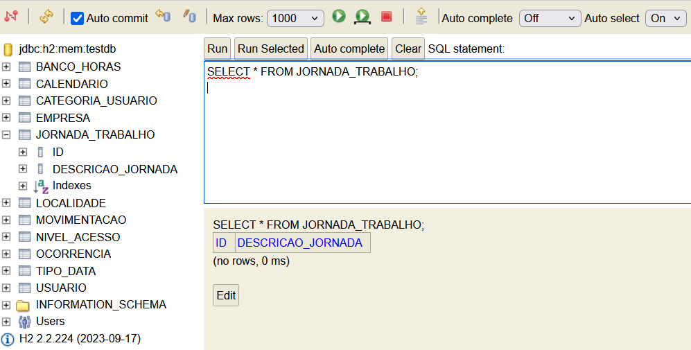

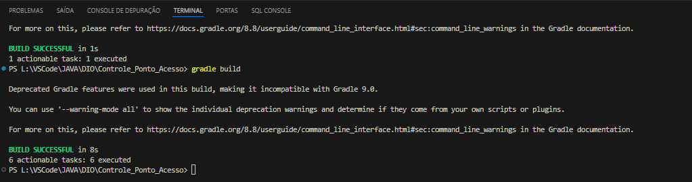

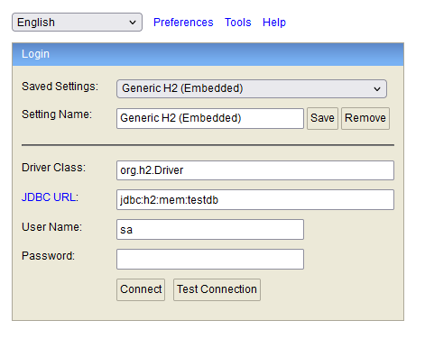

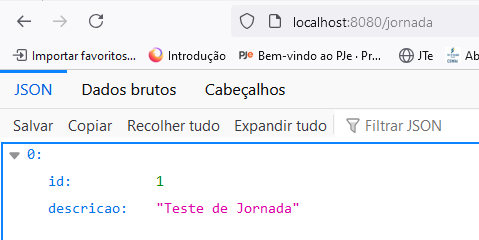

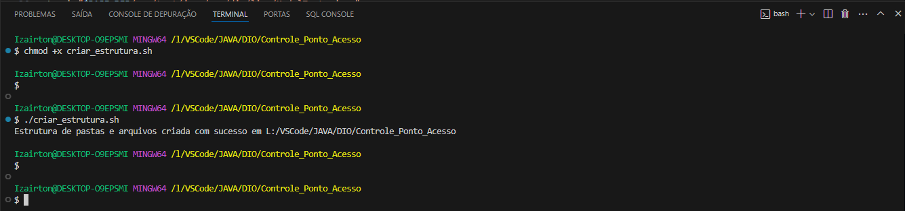

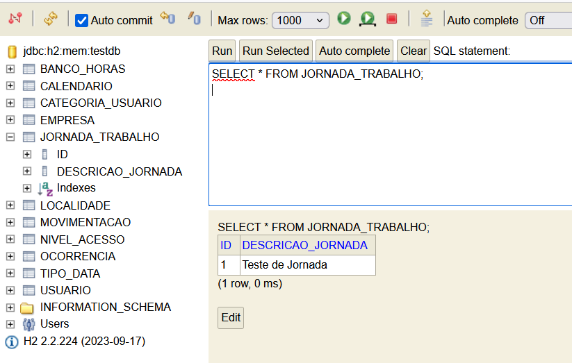

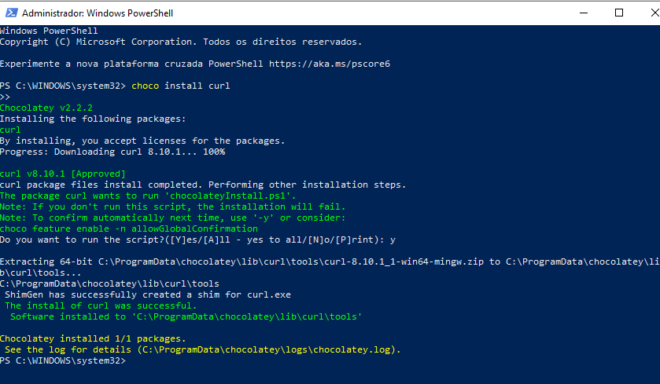

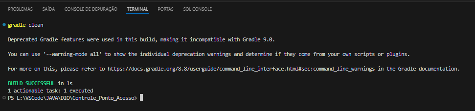

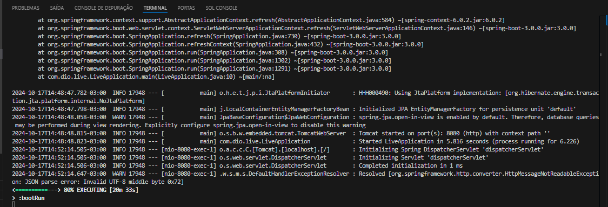

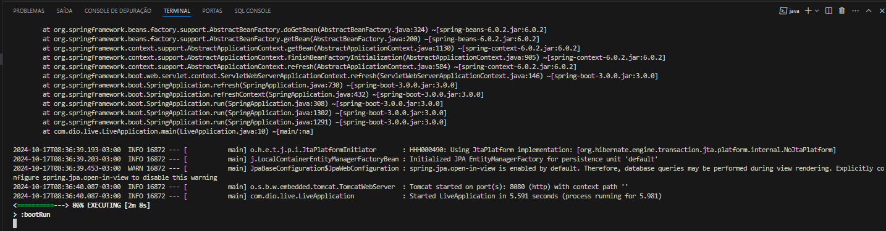

## Principais Arquivos do Projeto

### 1. `JornadaTrabalhoController.java`

Este arquivo representa o controlador da aplicação, responsável por lidar com as requisições HTTP e conectar essas requisições aos serviços e lógicas da aplicação. Ele contém as operações CRUD para a entidade "Jornada de Trabalho", utilizando as anotações do Spring Boot como `@RestController`, `@PostMapping`, `@GetMapping`, etc.

- **Papel principal**: Controlar as entradas e saídas da API relacionadas às jornadas de trabalho.
- **Operações básicas**:
  - **GET** para listar jornadas
  - **POST** para criar novas jornadas
  - **PUT** para atualizar jornadas existentes
  - **DELETE** para excluir jornadas

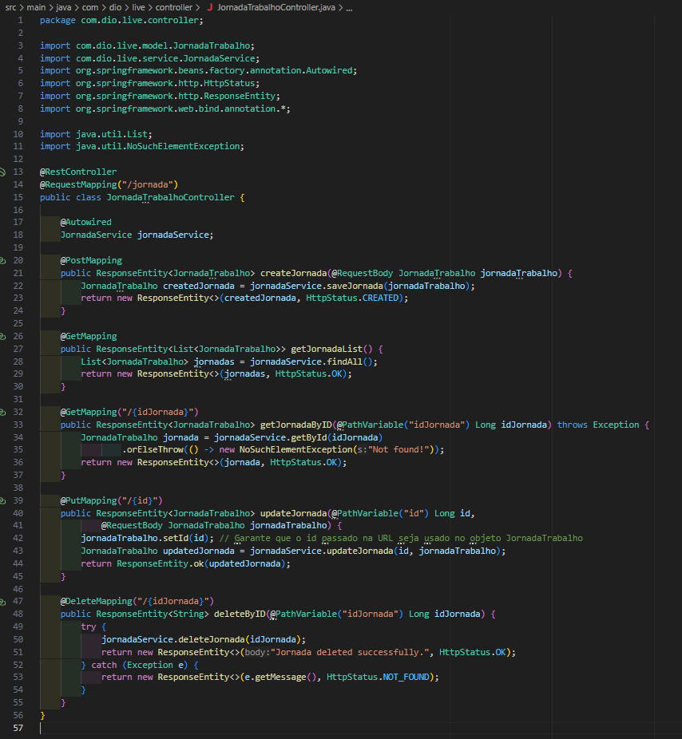

### 2. `application.properties`

Este arquivo é o ponto central de configuração da aplicação. Aqui, você define as propriedades da aplicação como informações de banco de dados, configurações de conexão, portas, e até integrações com outras tecnologias.

- **Papel principal**: Configurar a aplicação com parâmetros básicos.
- **Exemplos de propriedades**:
  - Configurações de banco de dados H2
  - Porta do servidor
  - Definições para o Spring Data JPA

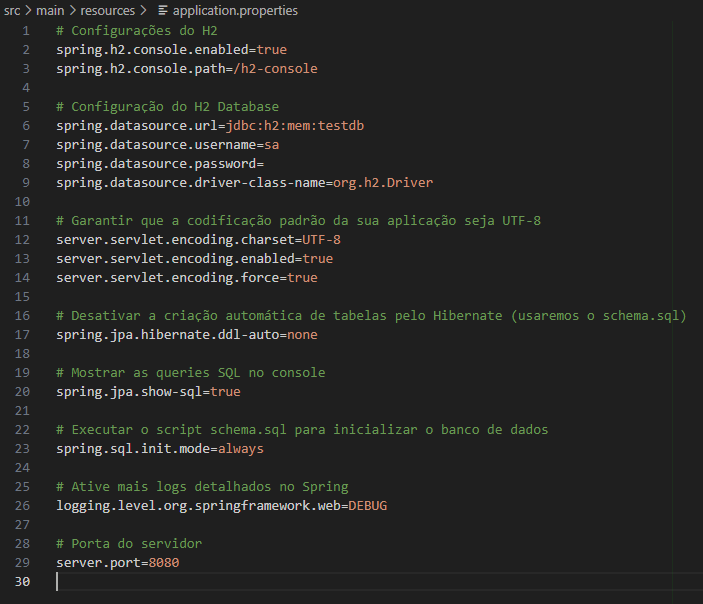

### 3. `build.gradle`

Este é o arquivo usado pelo Gradle, uma ferramenta de automação de build. Ele contém as configurações do projeto, como as dependências (bibliotecas e frameworks), o versionamento e a compatibilidade com versões de Java.

- **Papel principal**: Definir dependências e gerenciamento do ciclo de vida do projeto.
- **Tecnologias configuradas**:
  - Spring Boot (para o desenvolvimento da aplicação)
  - JPA/Hibernate (para a persistência de dados)
  - Lombok (para simplificar o código)
  - H2 (banco de dados em memória para testes)
  - Swagger (para documentar a API)

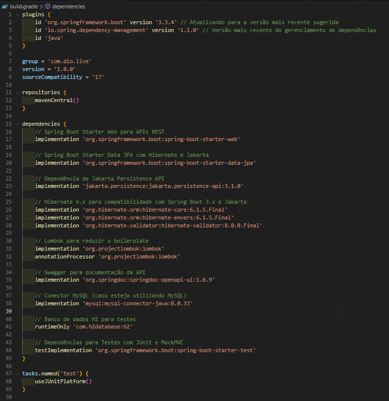

### 4. `schema.sql`

Este arquivo contém os comandos SQL que serão executados para criar e inicializar as tabelas no banco de dados. Ele é útil quando se deseja garantir que a estrutura do banco seja criada de maneira controlada, sem depender de mecanismos automáticos de geração de esquema.

- **Papel principal**: Definir o esquema de banco de dados (tabelas, chaves primárias, relacionamentos).
- **Exemplos**:
  - Definição da tabela `JornadaTrabalho` com colunas como `ID` e `DESCRICAO_JORNADA`.

### Por que esses arquivos são importantes?

Esses arquivos formam a espinha dorsal de qualquer aplicação baseada no Spring Boot. Eles ajudam a configurar a aplicação, a definir sua lógica de negócio, conectar ao banco de dados e realizar operações com as entidades de maneira eficiente.

### Considerações Finais

Este projeto demonstra como podemos aplicar tecnologias Java modernas para criar um sistema de controle de ponto robusto e escalável. Por meio do uso de Spring Boot, Hibernate Envers para auditoria e Swagger para documentação, a aplicação é uma base sólida para controle de acesso e registro de jornadas em qualquer empresa. Sugestões e melhorias são bem-vindas.
